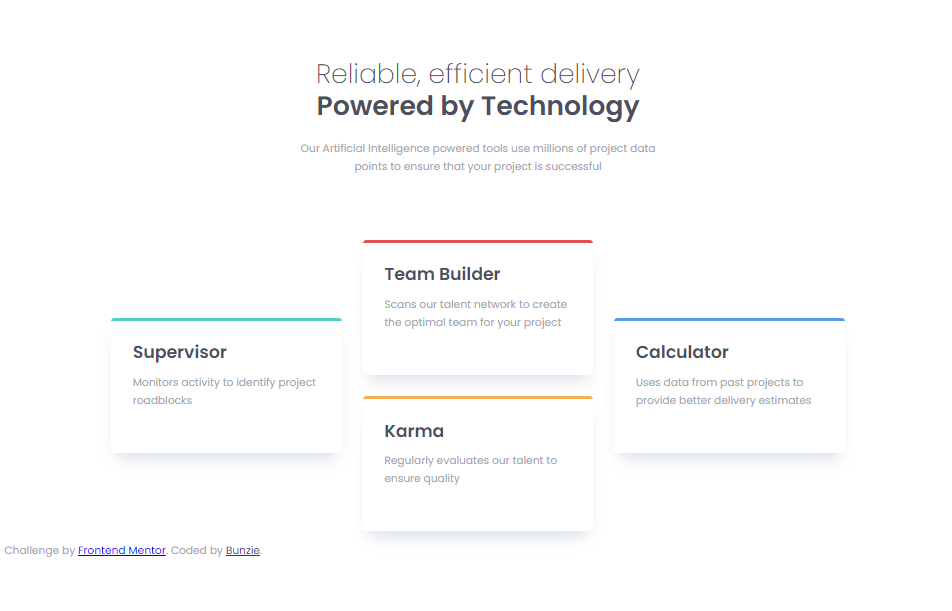

# Frontend-Mentor-4-Card-Feature-Section

## Table of Contents

- [Overview](#overview)
    - [The Challenge](#the-challenge)
    - [Visuals](#visuals)
    - [Links](#links)
- [My Process](#my-process)
    - [Built with](#built-with)
    - [What I learned](#what-i-learned)
    - [Continued Development](#continued-development)
    - [Useful Resources](#useful-resources)    
- [Author](#author)
- [Acknowledgments](#acknowledgements)

## Overview

### The Challenge

- This is my solution to the [Four card feature section challenge on Frontend Mentor](https://www.frontendmentor.io/challenges/four-card-feature-section-weK1eFYK). Frontend Mentor challenges help you improve your coding skills by building realistic projects. 

### Visuals

- Frontend Mentor's version 
 
 

- Sunny's Version 

### Links

- Frontend Mentor [Four Card Feature Section Challenge](https://www.frontendmentor.io/challenges/four-card-feature-section-weK1eFYK) 
- Github Repo [Frontend Mentor 4-Card-Feature-Section](https://github.com/0-Sunny-0/Frontend-Mentor-4-Card-Feature-Section)
- Github Deployed Site [https://0-sunny-0.github.io/Frontend-Mentor-4-Card-Feature-Section/](https://0-sunny-0.github.io/Frontend-Mentor-4-Card-Feature-Section/)

## My Process

### Built With

- Semantic HTML5 markup
- CSS custom properties
- Flexbox
- CSS Grid
- VS Code

### What I Learned

- Learned more about Flexbox and how to properly use it when styling/forming a webpage.
- Was able to understand media quieries a little more and how they shape your responsive layout.

### Continued Development

- Add the images for each card. 

### Useful Resources

- [W3Schools CSS .Class Selector](https://www.w3schools.com/cssref/sel_class.php)
- [W3Schools CSS Flexbox](https://www.w3schools.com/css/css3_flexbox.asp)
- [Responsive Layout Practice with Kevin Powell](https://www.youtube.com/watch?v=JFbxl_VmIx0)

## Author

- GitHub Profile - [Sunny Finch](https://github.com/0-Sunny-0)
- Frontend Mentor - [@0-Sunny-0](https://www.frontendmentor.io/profile/0-Sunny-0)

## Acknowledgements

Frontend Mentor 
- [Four Card Feature Section Challenge](https://www.frontendmentor.io/challenges/four-card-feature-section-weK1eFYK)

Kevin Powell 
- [Responsive Layout Practice](https://www.youtube.com/watch?v=JFbxl_VmIx0)
